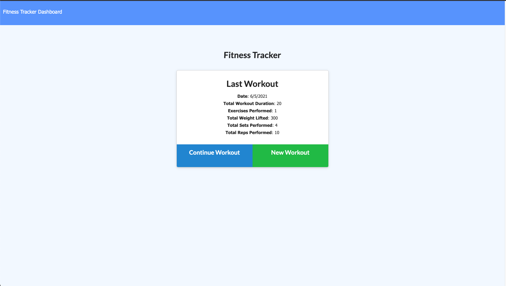
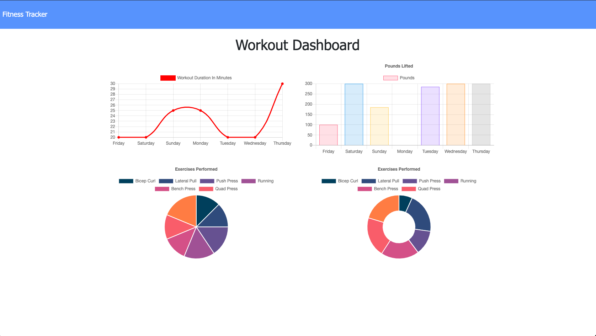

# Fitness-Workout-Tracker

</br>
<p align="center">
    
    
    
       
    
    
    
    
      
      
      
</p>

[](https://github.com/git/git-scm.com/blob/main/MIT-LICENSE.txt)

## Description

  
* This project is a fitness and workout tracker. You can create a new workout and the mark off each workout as you finish them. Your statistics are logged in a nice visual graph that help you keep track of your progress.

## User Story

```
As a user, I want to be able to view create and track daily workouts. I want to be able to log multiple exercises in a workout on a given day. I should also be able to track the name, type, weight, sets, reps, and duration of exercise. If the exercise is a cardio exercise, I should be able to track my distance traveled.
```

## Table of Contents
  * [Usage](#usage)
  * [Links](#links)
  * [Technologies Used](#technologies-used)
  * [License](#license)
  * [Contributions](#contributions)
  * [Questions](#questions)

## Usage

 
 
 

## Links
 
  * Heroku Deployed demo link: (https://aqueous-hamlet-70364.herokuapp.com/)
  * Github Repository URL: (https://github.com/CliffordMorin/Fitness-Workout-Tracker)

## Technologies Used

<p align="center">
    <a href="https://developer.mozilla.org/en-US/docs/Web/HTML"></a>
    <a href="https://developer.mozilla.org/en-US/docs/Web/CSS"></a>
    <a href="https://www.javascript.com/"></a>
    <a href="https://getbootstrap.com/"></a>
    <a href="https://nodejs.org/en/"></a>
    <a href="https://www.npmjs.com/package/express"></a>
    <a href="https://www.mongodb.com/"></a>
</p>


## License

  [](https://github.com/git/git-scm.com/blob/main/MIT-LICENSE.txt)

## Contributions

  Fork, request, or contact me.
  

## Questions

  [](https://github.com/CliffordMorin) 
  [](https://www.linkedin.com/in/morin-clifford-129888a9/)

  Feel free to reach me at cemorin21@gmail.com with any question regarding this project!
  